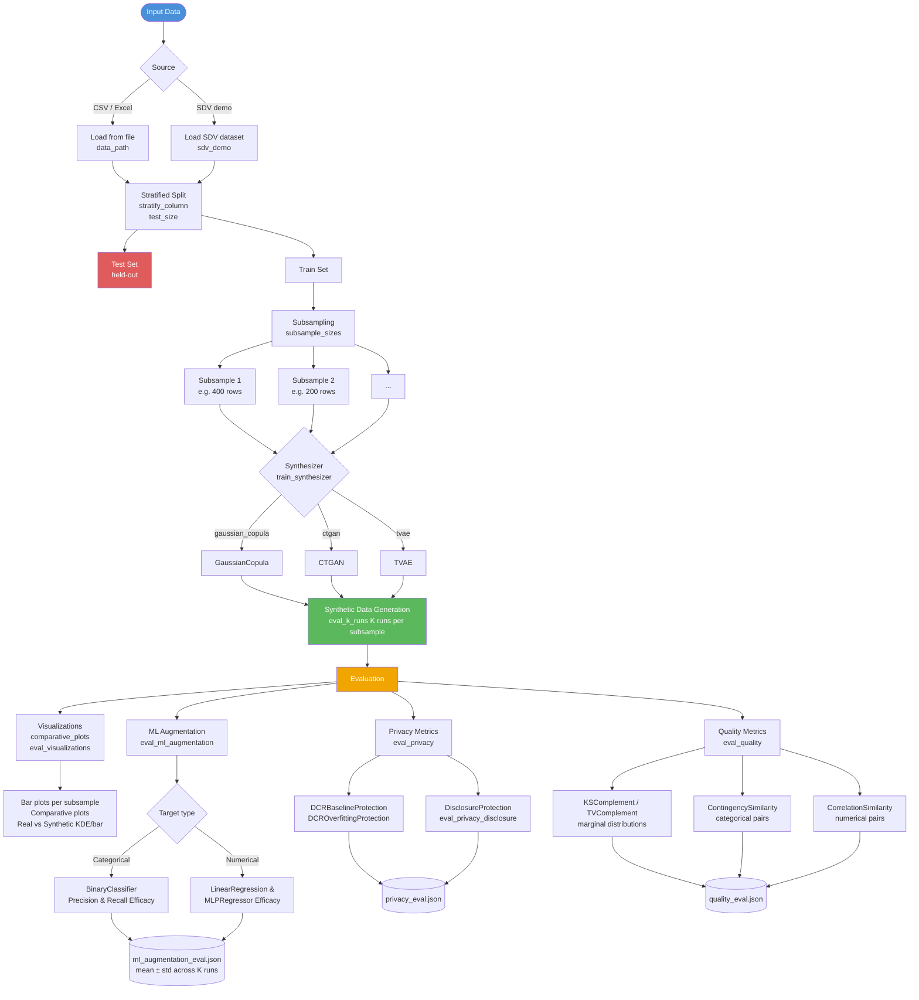

# Tabular Data Evaluation

A Python pipeline for evaluating synthetic tabular data generation. It loads tabular datasets, creates stratified train/test splits, trains SDV (Synthetic Data Vault) synthesizers on subsamples, generates synthetic data, and evaluates quality via visualizations and ML augmentation metrics.

## Pipeline Overview



## Quickstart: YAML Config

All runs are configured via a YAML file and launched with a single command:

```bash
python tabular_evaluation.py --config config.yaml
```

Three ready-to-use configs are provided for common use cases:

- **Categorical medical/health data** (`child` demo):

  ```bash
  python tabular_evaluation.py --config config_cat_only.yaml
  ```

- **Text-derived / news data** (`news` demo):

  ```bash
  python tabular_evaluation.py --config config_num_only.yaml
  ```

- **Mixed categorical + numerical data** (`adult` demo):

  ```bash
  python tabular_evaluation.py --config config_cat_and_num.yaml
  ```

CLI arguments always override config file values, so you can override a single key without editing the file:

```bash
python tabular_evaluation.py --config config_cat_only.yaml --eval-k-runs 10 --quiet
```

- **Minimal quality-only evaluation (no ML, no privacy)**:

  ```yaml
  # minimal_quality.yaml
  sdv_demo: true
  sdv_modality: "single_table"
  sdv_dataset: "adult"
  stratify_column: "label"
  test_size: 1000
  subsample_sizes: "400,200"
  train_synthesizer: "gaussian_copula"
  eval_quality: true
  eval_quality_subsample: 500
  save_datasets: true
  output_dir: "output"
  ```

  ```bash
  python tabular_evaluation.py --config minimal_quality.yaml
  ```

---

## Features

- **Data loading**: CSV/Excel files or [SDV demo datasets](https://docs.sdv.dev/sdv/datasets/demos)
- **Stratified splitting**: Train/test split and subsamples for low-data scenarios
- **Synthesizers**: Gaussian Copula (fast), CTGAN, TVAE
- **Visualizations**:
  - Bar plots for each subsample
  - Comparative plots across subsamples (and optionally synthetic data)
  - Real vs synthetic distribution plots (per column, with optional K-run mean±std overlays)
- **ML augmentation metrics**:
  - **Classification**: BinaryClassifierPrecisionEfficacy and BinaryClassifierRecallEfficacy (via SDMetrics)
  - **Regression**: LinearRegression and MLPRegressor ML efficacy scores when the prediction target is numerical
- **Privacy metrics** (via SDMetrics):
  - DCRBaselineProtection, DCROverfittingProtection
  - Optional DisclosureProtection with configurable attacker-known and sensitive columns
- **Quality metrics** (via SDMetrics):
  - KSComplement / TVComplement (marginal distributions)
  - ContingencySimilarity (categorical/mixed pairs)
  - CorrelationSimilarity (numerical pairs; Pearson or Spearman)
  - Configurable subsampling and real-association/correlation thresholds

---

## Requirements

- Python 3.9+
- pandas, scikit-learn
- matplotlib, seaborn (for plots)
- [SDV](https://github.com/sdv-dev/SDV) (for synthesizers and demo data)
- xgboost (for ML augmentation metrics)
- PyYAML (for config file support)

```bash
pip install pandas scikit-learn matplotlib seaborn sdv xgboost pyyaml
```

---

## YAML Configuration Reference

All options can be set in a YAML file and passed via `--config`. Keys map directly to CLI flag names with hyphens replaced by underscores (e.g. `--eval-k-runs` → `eval_k_runs`). CLI flags always take precedence over the config file.

### Data loading and splitting

| Key | CLI equivalent | Description |
|-----|----------------|-------------|
| `data_path` | `--data-path PATH` | Load from CSV/Excel file. Supported extensions: `.csv`, `.xlsx`, `.xls`. |
| `sdv_demo` | `--sdv-demo` | Use an SDV demo dataset instead of a file. |
| `sdv_modality` | `--sdv-modality` | SDV modality (e.g. `single_table`, `multi_table`). |
| `sdv_dataset` | `--sdv-dataset` | Demo dataset name: `child`, `news`, `adult`, etc. |
| `stratify_column` | `--stratify-column` | Column for stratified sampling (also the default prediction target). Numeric columns are automatically binned into quantiles for stable stratification. |
| `test_size` | `--test-size` | **Number of rows** in the held-out test set (not a fraction). |
| `subsample_sizes` | `--subsample-sizes` | Comma-separated subsample sizes (e.g. `"400,200"`) drawn from the training set, stratified on `stratify_column`. |
| `random_state` | `--random-state` | Random seed for reproducible splits and synthesizer training. |
| `output_dir` | `-o` / `--output-dir` | Base output directory (default: `output`). |
| `save_datasets` | `--save-datasets` | Save `train_data.csv`, `test_data.csv`, and all `subsample_*.csv` files. |
| `quiet` | `-q` / `--quiet` | Reduce console verbosity. |

### Basic plots and comparative plots

| Key | CLI equivalent | Description |
|-----|----------------|-------------|
| `no_plots` | `--no-plots` | Skip per-subsample bar plots. |
| `comparative_plots` | `--comparative-plots` | Generate comparative plots per column showing all subsamples (and, when synthesizers are enabled, also synthetic variants). Categorical columns use percentage bar charts; numerical columns use box plots. |

### Synthesizer training and synthetic data

| Key | CLI equivalent | Description |
|-----|----------------|-------------|
| `train_synthesizer` | `--train-synthesizer` | Enable SDV single-table synthesizer training. Choices: `gaussian_copula`, `ctgan`, `tvae`. |
| `save_synthetic` | `--save-synthetic` | Save generated synthetic datasets as CSV files under `output/synthetic/<dataset>/<synthesizer>/`. |
| `synthesizer_epochs` | `--synthesizer-epochs` | Training epochs for CTGAN/TVAE (ignored for GaussianCopula). |
| `eval_k_runs` | `--eval-k-runs` | Train the synthesizer K times per subsample, producing K synthetic datasets. All evaluation metrics aggregate scores across these runs (mean±std). |

### Real vs synthetic distribution plots

| Key | CLI equivalent | Description |
|-----|----------------|-------------|
| `eval_visualizations` | `--eval-visualizations` | Generate column-wise real vs synthetic distribution plots for each subsample under `eval_plots/`. |
| `eval_plot_format` | `--eval-plot-format` | File format for evaluation plots: `pdf` or `png` (default: `pdf`). |

### ML augmentation evaluation

These metrics answer: **if we augment the real training data with synthetic data, how well do downstream models perform on real held-out test data?**

| Key | CLI equivalent | Description |
|-----|----------------|-------------|
| `eval_ml_augmentation` | `--eval-ml-augmentation` | Enable ML augmentation evaluation. For categorical targets, runs **BinaryClassifierPrecisionEfficacy** and **BinaryClassifierRecallEfficacy**; for numerical targets, runs **LinearRegression** and **MLPRegressor** ML efficacy metrics. |
| `prediction_column` | `--prediction-column` | Target column name. Defaults to `stratify_column`. |
| `minority_class_label` | `--minority-class-label` | Required for **categorical** targets; defines the positive/minority class (e.g. `">50K"`). Not required when the prediction column is numerical. |
| `ml_label_encode` | `--ml-label-encode` | Label-encode categorical features to integers prior to ML evaluation. Avoids XGBoost `enable_categorical` issues with many categorical columns. |
| `eval_ml_max_epochs` | `--eval-ml-max-epochs` | Max estimators/epochs for XGBoost in ML augmentation evaluation. |

ML augmentation outputs are saved to `ml_augmentation_eval.json` (see **Output Structure** below).

### Privacy evaluation

| Key | CLI equivalent | Description |
|-----|----------------|-------------|
| `eval_privacy` | `--eval-privacy` | Enable privacy evaluation across synthetic datasets using SDMetrics. Computes **DCRBaselineProtection** and **DCROverfittingProtection**. |
| `eval_privacy_subsample` | `--eval-privacy-subsample` | Optionally subsample N rows when computing DCR metrics, to speed up evaluation on large datasets. |
| `eval_privacy_disclosure` | `--eval-privacy-disclosure` | Additionally compute **DisclosureProtection**, which estimates how well an attacker could infer sensitive attributes from known attributes. |
| `eval_privacy_disclosure_known` | `--eval-privacy-disclosure-known` | Comma-separated list of attacker-known columns (e.g. `"Age,Sex"`). |
| `eval_privacy_disclosure_sensitive` | `--eval-privacy-disclosure-sensitive` | Comma-separated list of sensitive target columns (e.g. `"Disease"`). |
| `eval_privacy_disclosure_continuous` | `--eval-privacy-disclosure-continuous` | Optional list of continuous columns that should be discretized for DisclosureProtection. |
| `eval_privacy_disclosure_computation` | `--eval-privacy-disclosure-computation` | CAP computation method: `cap`, `generalized_cap`, or `zero_cap` (default: `cap`). |

Privacy outputs are saved to `privacy_eval.json` (see **Output Structure** below).

### Quality evaluation (statistical similarity)

| Key | CLI equivalent | Description |
|-----|----------------|-------------|
| `eval_quality` | `--eval-quality` | Enable statistical quality metrics comparing real vs synthetic data. |
| `eval_quality_subsample` | `--eval-quality-subsample` | Optionally subsample N rows per evaluation to reduce runtime on large datasets. |
| `eval_quality_threshold` | `--eval-quality-threshold` | Real association threshold for **ContingencySimilarity**; pairs below this threshold are set to NaN. Recommended: `0.3` or higher. |
| `eval_quality_correlation_coefficient` | `--eval-quality-correlation-coefficient` | Correlation coefficient used by **CorrelationSimilarity**: `Pearson` or `Spearman` (default: `Pearson`). |
| `eval_quality_correlation_threshold` | `--eval-quality-correlation-threshold` | Real correlation threshold for **CorrelationSimilarity**; pairs with \|r\| below this threshold are ignored. Recommended: `0.4` or higher. |

Quality outputs are saved to `quality_eval.json` (see **Output Structure** below).

---

## Provided Config Files: Use Cases

### 1. `config_cat_only.yaml` — Categorical Medical/Health Data (`child` demo)

| Setting | Value |
|---------|-------|
| **Dataset** | `child` (SDV demo) |
| **Stratify** | `Disease` |
| **Prediction** | `Sick` (binary: yes/no) |
| **Minority class** | `yes` |
| **Evaluations** | ML augmentation (binary classification), privacy (including DisclosureProtection), quality |

**Use case**: Datasets with mostly categorical columns and medical-style outcomes (e.g., diseases, diagnoses, yes/no flags). Configured to evaluate ML augmentation performance on a binary outcome (`Sick`) and DisclosureProtection with attacker-known column `Disease` and sensitive column `Age`.

```bash
python tabular_evaluation.py --config config_cat_only.yaml
```

---

### 2. `config_num_only.yaml` — News / Text-Derived Data (`news` demo)

| Setting | Value |
|---------|-------|
| **Dataset** | `news` (SDV demo) |
| **Stratify** | `label` |
| **Prediction** | `label` |
| **Minority class** | `50000+` (adjust for your label semantics) |
| **Evaluations** | ML augmentation (binary classification), privacy, quality |

**Use case**: Datasets from news or similar text-derived sources where the prediction target is a single categorical label column. Adjust `minority_class_label` in the config to match your positive class.

```bash
python tabular_evaluation.py --config config_num_only.yaml
```

---

### 3. `config_cat_and_num.yaml` — Adult / Mixed Categorical + Numerical (`adult` demo)

| Setting | Value |
|---------|-------|
| **Dataset** | `adult` (SDV demo) |
| **Stratify** | `label` (income) |
| **Prediction** | `label` |
| **Minority class** | `>50K` |
| **ML label encode** | `true` |
| **Evaluations** | ML augmentation (binary classification), privacy, quality |

**Use case**: Datasets with both categorical and numerical features (e.g., Adult income: age, education, occupation, etc.). Uses `ml_label_encode: true` for high-cardinality categoricals to ensure reliable ML augmentation evaluation.

```bash
python tabular_evaluation.py --config config_cat_and_num.yaml
```

---

## Custom Data

To use your own CSV, copy the closest config file and edit the data source section:

```yaml
# Replace the sdv_demo block:
# sdv_demo: true
# sdv_modality: "single_table"
# sdv_dataset: "adult"

# With:
data_path: "/path/to/your/data.csv"
stratify_column: "your_target_column"
prediction_column: "your_target_column"
minority_class_label: "your_positive_class"   # for categorical targets
```

For datasets with many categorical columns, set `ml_label_encode: true` to avoid XGBoost encoding errors.

```bash
python tabular_evaluation.py --config my_custom_config.yaml
```

---

## Output Structure

```
output/
├── <dataset>/                    # e.g. child, news, adult
│   ├── train_data.csv
│   ├── test_data.csv
│   ├── subsample_400.csv
│   ├── subsample_200.csv
├── plots/
│   └── <dataset>/
│       ├── subsample_*.png       # Bar plots per subsample (unless no_plots: true)
│       └── comparative/          # Comparative plots per column across subsamples (and optionally synthetic)
│           └── *.png
└── synthetic/<dataset>/<synthesizer>/
    ├── subsample_*_synthetic_run0.csv
    ├── subsample_*_synthetic_run1.csv
    ├── subsample_*_synthetic_run*.csv
    ├── subsample_*_metadata.json
    ├── eval_plots/               # Real vs synthetic plots (if eval_visualizations: true)
    │   └── subsample_*/
    │       └── column_*.pdf/.png
    ├── ml_augmentation_eval.json # If eval_ml_augmentation: true
    ├── privacy_eval.json         # If eval_privacy: true
    └── quality_eval.json         # If eval_quality: true
```

### JSON output files

- **`ml_augmentation_eval.json`** (per dataset & synthesizer)
  - Top-level keys: subsample names (e.g. `subsample_400`, `subsample_200`).
  - Each subsample contains metric objects, e.g.:
    - `BinaryClassifierPrecisionEfficacy`, `BinaryClassifierRecallEfficacy` for categorical targets.
    - `LinearRegression`, `MLPRegressor` for numerical targets.
  - Each metric object stores:
    - `mean`: average score across K synthetic runs.
    - `std`: standard deviation across K runs.
    - `scores`: list of per-run scores.

- **`privacy_eval.json`**
  - Top-level keys: subsample names.
  - Each subsample includes metrics such as:
    - `DCRBaselineProtection`: mean±std across runs; may include `median_DCR_to_real_data`.
    - `DCROverfittingProtection`: mean±std across runs; may include `synthetic_data_percentages` describing how many synthetic rows are close to training vs validation data.
    - `DisclosureProtection` (if configured): mean±std, and optional fields such as `cap_protection` and `baseline_protection`.

- **`quality_eval.json`**
  - Top-level keys: subsample names.
  - Each subsample includes metrics such as:
    - `KSComplement`: summary over numerical marginals with per-column means and counts.
    - `TVComplement`: summary over categorical marginals with per-column means and counts.
    - `ContingencySimilarity`: pairwise categorical/mixed association quality (with `num_pairs`, `total_pairs`, and optional `pair_means`).
    - `CorrelationSimilarity`: pairwise numerical correlation quality (with `num_pairs`, `total_pairs`, `pair_means`, and the correlation `coefficient` used).
  - For all metrics, only summary statistics (mean/std, counts, and per-column/pair means) are stored; raw per-run scores are not persisted to keep the files compact.

---

## Quick Reference: Which Config to Use?

| Your data type | Config file |
|----------------|-------------|
| Medical/health, mostly categoricals | `config_cat_only.yaml` |
| News/text-derived, single label | `config_num_only.yaml` |
| Census-/Adult-like, many categoricals + numeric | `config_cat_and_num.yaml` |
| Custom CSV | Copy any config above, set `data_path` |

---

## License

See repository license file.
